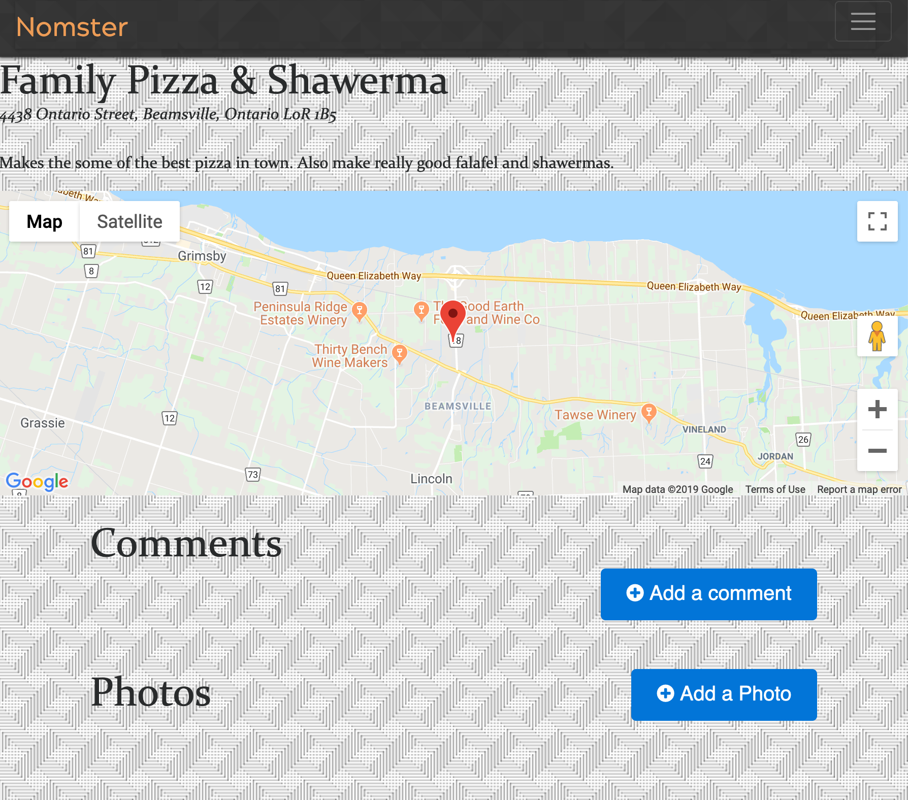
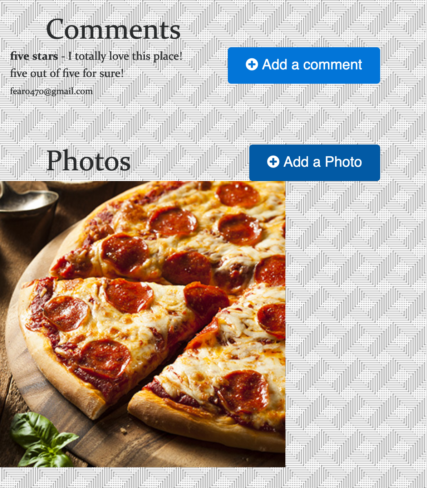

<h1>Nomster</h1>
<h2>Ruby on Rails framework.</h2>

Nomster is a Yelp clone app that lets users make a profile, post pizza plaes, and comment on other restaurants. You can check it out here. Sign up, add some of your place to get a slice and discover new ones too!

Features:
<ul>
  <li>  Google Maps API is integrated to let users see where a restaurant is located when checking the place page..</li>

   <li>   Twitter Bootstrap 3 was utilized for CSS and components. </li>

  <li>    Devise is used for user security and forms.</li>

  <li> A homepage slider with an image carousel to switch between photos.</li>

  <li> Users can comment on other restaurant pages.</li>

  <li> Amazon Web Services (S3) is used for photo storage when users upload photos.</li>

  <li> Profile page shows which restaurants the user has created, which restaurants the user has commented on, and other stats.</li>
</ul>

Here is an example of a pizza place posted to the site. 

 

Here is an example of a user uploaded comment and a user uploaded image attached to the restaurant page. 

